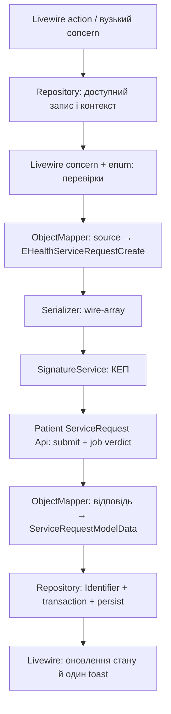

# Рефактор eHealth без прикладного сервісного шару

Оновлено 23.09.2026 за уточненнями автора й прикладом тімліда: операції розподіляємо між Livewire, API-класами, enum і вузькими трейтами; mapping організовуємо за призначенням ModelData/EHealthData/FormData з підтримкою кількох типів джерел. Окремий шар Actions та нові класи Rules/Managers/Coordinators не вводимо.

Issue: [#841](https://github.com/openhealths/nationHealth/issues/841). Робоча гілка: `Mefizz/ohealth:i841_object_mapper_service_request`, база #792 `d91299f72ffa115de7a441d7cb6a8d3475f6fe94`. Рефактор не публікується в гілку #792. Після merge #792 — rebase на фактичний upstream main і повторні перевірки. Стан реалізації та результати тестів: [object-mapper-refactor.md](object-mapper-refactor.md).

## 1. Кінцевий результат

У перенесених медичних сценаріях немає залежностей від `App\Services\MedicalEvents`. Відповідні Service/Lifecycle/Guard/Mapper-класи видаляються після міграції всіх callers. Перенесення класу з тим самим набором обов'язків у `Actions`, `Classes` або великий трейт не вважається завершенням.

Зберігаємо наявні Repository та Eloquent для БД, Symfony ObjectMapper і DTO для контрактів. Вони виконують конкретну технічну роботу й не утворюють новий шар керування сценаріями. Не додаємо laravel-data, CQRS, generic repositories, універсальний FHIR SDK або інтерфейси заради одного класу.

SignatureService і dictionary infrastructure — раніше визначені винятки: їхню поведінку зберігаємо. Вони не виправдовують збереження medical lifecycle services. Повне фізичне очищення `app/Services`, включно з цими винятками та сторонніми модулями, відокремлено від медичного рефактору в розділі 8; не заявляємо, що #841 очищає всю папку.

## 2. Межі відповідальності

### Livewire: сценарій користувача

Компонент володіє формою, валідацією, перевіркою доступу до операції, відкриттям КЕП-модалки, loading state і повідомленнями. З нього має бути видно порядок: завантажити доступний запис → перевірити умови → побудувати DTO → підписати → викликати API → перевірити результат → записати → оновити UI.

Короткий сценарій залишається в компоненті. Повторювані частини для care plan, encounter і patient registry стають protected-методами спільного трейта. Сценарій не передається одному методу на кшталт `runLifecycle()` з десятками прихованих побічних ефектів.

Нові трейти розташовуємо у `app/Livewire/Concerns/MedicalEvents/{Referral,MedicationRequest,CarePlan,Activity}`; поведінка конкретного екрана лишається у його наявному `Concerns`. Поточні `ManagesCarePlanReferrals`, `ManagesEncounterReferrals`, `CarePlanManager` спочатку розділяємо за операціями, а не наповнюємо новою логікою.

### Api: взаємодія з ЕСОЗ

`app/Classes/eHealth/Api` володіє endpoints, HTTP, transport envelopes, response validation, pagination та перевіркою remote job/verdict. Існуючі низькорівневі методи й типи відповіді глобально не змінюємо.

Для операцій, що потребують завершеного результату, додаємо явні методи на відповідному API-класі, наприклад `createSignedAndResolve()` чи `prequalifyAndValidate()`. Назва показує очікування job; метод GET не починає приховано polling. Спільний транспортний алгоритм — у `app/Classes/eHealth/Api/Concerns/ResolvesEHealthJobs`, специфічний endpoint — у своєму Api. Спільні helpers трейта protected, без UI-стану й Eloquent.

Api не читає `auth()`, не отримує `$this->form`, не викликає SignatureService, не записує клінічні записи в БД, не надсилає Livewire events і не обирає текст toast. Він отримує payload/UUID явно, повертає валідовані дані або кидає типізований виняток. Наявний async approval polling через jobs/EhealthLink зберігається: його не замінюємо синхронним очікуванням.

### Enum: значення та властивості цих значень

`app/Enums` містить status, kind, source, resource type, terms of service та outcomes. Методи enum можуть відповідати на `isFinal()`, `isDraft()`, `canBeCancelled()` лише якщо відповідь визначається самим значенням. Якщо потрібні доступи, кількість, контракти чи стан інших документів — перевірка залишається у Livewire concern з явно підготовленими даними.

Enum не виконує SQL, HTTP, `app()`, `auth()` або перевірок прихованого стану. Статус job і статус медичного ресурсу — різні контракти; не створюємо один універсальний enum. Розширюємо наявні enum перед введенням нових. `CarePlanTermsOfService`, `Medication/RequestSource`, `Medication/RequestResourceType` уже існують у #792.

### Repository: дані та атомарність

Наявні `app/Repositories` залишаються місцем для scoped queries, aggregate queries, upsert, Identifier/FK, транзакцій і блокувань. Перевірка належності запису пацієнту/закладу виконується до мапінгу та підпису, а не після HTTP.

Repository отримує `*Write` або погоджений масив даних, а не Livewire-компонент чи eHealth client. Він не формує КЕП-документ, не виконує HTTP та не генерує HTML. Не переносимо сирий SQL у компонент заради видалення сервісу.

Перевірка кількості й блокування залишаються в тій самій атомарній області, що й відповідний локальний запис. Довгий HTTP/polling не додаємо всередину SQL-транзакції. Поточну поведінку lock спочатку фіксуємо тестами; окремо перевіряємо паралельні та повторні підписи. DTO із попередньо обчисленою кількістю не є резервуванням.

### ObjectMapper: чисте перетворення контрактів

`app/Mapping/EHealth/{Referral,MedicationRequest,CarePlan,CarePlanActivity,Shared}` — source snapshots, target DTO та Map-метадані. `app/Mapping/Transforms` — невеликі чисті перетворення. Нормалізація до wire-array залишається поруч із контрактом; вона не виконує workflow.

Атрибути ставимо на DTO, не на Eloquent і не на Livewire. Source містить валідовані поля й підготовлені UUID/час; він не є публічною властивістю компонента. Не передаємо mapper весь компонент або Model із lazy-loading relations.

`ServiceRequestPayloads` у поточному інкременті — лише адаптер ObjectMapper/Serializer зі збереженням порядку ключів. До нього заборонено додавати API, Repository, підпис, lookup чи UI-поведінку. Він не замінює LifecycleService і не росте в новий сервіс.

### Уточнення за прикладом тімліда: ModelData / EHealthData / FormData

Це цільовий підхід за замовчуванням. Попередній outbound spike не реалізував його повністю: він вводить `ServiceRequestInput` і target-класи конкретних API-операцій, але ще не має багатоджерельного ModelData та FormData. Не описувати поточний код як готову реалізацію пропозиції тімліда.

Для ресурсу визначаємо класи за призначенням, а не окремий DTO на кожну стрілку:

- `DivisionModelData`: поля для локальної моделі; приймає валідовану форму або валідований eHealth source. Різницю назв/форматів описують атрибути та `SourceClass` conditions в одному класі.
- `DivisionEHealthData`: дані для eHealth; джерелом може бути існуюча модель або валідована форма. Однаковий wire-контракт не потребує окремих DTO для кожного джерела.
- `DivisionFormData`: редаговані поля форми; джерело — модель або eHealth. Не містить UI flags, credentials, permissions чи стан модалок.

Класи створюємо лише за фактичної потреби: не обов'язково рівно три для кожного ресурсу. Використовуємо наявні типи Form/Model та object-source для API; не додаємо копію кожного джерела лише для `instanceof`. Для stdClass різницю ресурсів задає явний target; різні stdClass самі по собі не розрізняються через SourceClass. Якщо відрізняється структура, потрібні явні правила або інший тип джерела, а не припущення про походження об'єкта.

Symfony `SourceClass`/`TargetClass` дозволяють застосувати mapping для одного з кількох класів. Це не об'єднання кількох source objects за один `map()` і не автоматичне сканування будь-яких класів з суфіксом Data. Щоб правила DivisionModelData застосувалися, він повинен бути source/target у виклику або бути явно підключений через metadata configuration. Сам виклик `map($source, Division::class)` не знаходить сторонній DivisionModelData за назвою. [Офіційна документація](https://symfony.com/doc/current/object_mapper.html#matching-multiple-classes).

Приклад `new Division($mapper->map(..., Division::class))` розглядаємо як ескіз, не готовий Laravel-код: map приймає object і повертає object, Eloquent constructor — array. У нас EHealthResponse::validate() і дані DivisionForm повертають масиви, тому потрібна явна object-межа з урахуванням вкладених структур.

Наступний spike перевіряє два кроки: source → DivisionModelData → уже створений `new Division()` або завантажена модель; після цього явний save. Правила mapping зберігаються на Data-класі. Перевірити HasCamelCasing, casts, mutators, події, дозволені до запису поля та незмінність identity/ownership. Якщо потрібен масив для fill, нормалізується тільки погоджений набір полів; не вводимо загальний mapper, який повертає то array, то object.

Repository не є обов'язковою обгорткою простого save однієї моделі. Проте він залишається потрібним для транзакцій, scoped lookup, кількох таблиць і FHIR Identifier relationships, навіть коли всередині використовується Eloquent. Ці операції не є рутинним копіюванням DTO-полів.

Для ServiceRequest: переглянути наявні Input/Body/Payloads на користь `ServiceRequestModelData`, `ServiceRequestEHealthData` і, лише якщо потрібне заповнення форми, `ServiceRequestFormData`. Поточний задум ServiceRequestWrite відповідає ролі ModelData; не тримати обидві назви для тієї самої структури. Це напрям наступної реалізації, ще не виконане перейменування.

Виняток із одного EHealthData — справді різні контракти: prequalify envelope і документ для КЕП, create і raw cancel/reject, medication draft і prescription. Спочатку повторно використовуємо спільні дані, потім окремий transport envelope в API або вузький contract DTO, якщо цього потребують відмінні поля/правила. Кількість класів не скорочуємо шляхом прихованого режиму, який змінює підписуваний JSON.

Перед масштабуванням потрібні перевірки усіх реально підтримуваних напрямків: Form → Model, API → Model, Model → Form, Model → API та за потреби Form → API/API → Form; missing/null/[] при sync; точні JSON bytes перед підписом. Поточні 124 тести підтверджують попередній outbound spike, а не ще не реалізоване multi-source mapping.

## 3. Правила для трейтів

- Один трейт відповідає за одну операцію або зв'язану групу перевірок: наприклад `SignsServiceRequests`, `SyncsServiceRequests`, `ValidatesActivityIssuance`, `ValidatesCarePlanCompletion`. Це приклади цільових ролей, не вимога створити всі файли наперед.
- Спільні методи приймають явні typed arguments: source, request, patient/legal-entity context. Трейт не припускає наявності `$this->carePlan`, `$this->activity` або полів іншого трейта. Потрібну host-залежність оголошує abstract-методом із return type.
- Типово методи protected/private. Public — лише навмисні Livewire actions, з повторною серверною перевіркою доступу; не робити helper public для зручності виклику між трейтами.
- Без constructor, singleton state, глобального cache поточного пацієнта та прихованого boot/hydrate. Публічний стан і Locked-поля оголошує компонент.
- Залежності надходять через Laravel DI у action/boot або явні параметри; не копіюємо `app()` в кожну гілку алгоритму. API traits не залежать від Livewire traits і навпаки.
- Повторне використання допускається між власниками з однаковою семантикою. Якщо два компоненти виконують різні операції, невелике повторення викликів краще за трейт з перемикачами десятка режимів.
- UI-логіка тестується через реальний компонент; Api concern — через API-класи з mocked HTTP. Тести не повинні перевіряти лише факт наявності `use SomeTrait`.
- Коли поведінка потрібна queue job або command, transport/persistence беруться з тих самих Api/Repository. Не створюємо Livewire-компонент у worker. Чистий reusable trait за такої потреби розміщується у `app/Concerns/MedicalEvents` з явними аргументами, без Livewire API.

## 4. Приклад вертикального ServiceRequest flow

Care plan, encounter і patient registry готують власний контекст доступу та використовують один mapping контракт. Спільний concern може реалізувати повторюваний крок підпису чи синхронізації, але не приховує різницю джерел і не містить універсальну фабрику всіх медичних ресурсів.

Для prequalify: source → `EHealthServiceRequestPrequalify` → Api перевіряє verdict → Repository створює локальну чернетку. Pending або INVALID не трактуються як дозвіл зберегти успішний результат. При збої API локальний clinical status не стає active.

## 5. Куди переходить кожна медична відповідальність

- `ReferralRequestLifecycleService`: create/sign/sync/cancel/recall послідовності — Livewire concerns; endpoints/SMS/job verdict — ServiceRequest/DeviceRequest Api; запити, контекст, persisted fields — repositories; mapping — DTO; print HTML/barcode — Blade та print concern. Після міграції всіх callers клас видаляється.
- `MedicationRequestLifecycleService`: concerns create/sign/reject/sync; API отримує готові payload; Repository розв'язує контекст і зберігає raw snapshot. Пріоритет підпису raw draft → fetched raw → локальний fallback зберігається.
- `CarePlanLifecycleService`, `CarePlanActivityLifecycleService`, `DeviceRequestLifecycleService`: короткі wrappers розчиняються в явних методах Api; UI sequence — у наявних компонентах/вузьких concerns. Не дублюємо кожен API-метод ще одним UI-трейтом без поведінки.
- `EHealthRequestLifecycleService`: базове наслідування видаляється. Transport error handling/prequalify resolution — Api concerns; signer tax ID перевіряється на межі підписання в Livewire, до відправлення документа.
- `EHealthJobResolver`: polling, fallback URL, timeout та успішність — `Api/Concerns/ResolvesEHealthJobs`; статуси — окремий enum контракту job, якщо наявний enum не відповідає цьому набору. Зберегти 404 fallback, інтервали, ліміти й типи винятків; не змінювати їх разом із переносом.
- `CarePlanLifecycleGateService`: запити відкритих документів — Repository; властивості статусів — enum; поєднання умов cancel/complete — `ValidatesCarePlanCompletion`/відповідний concern; текст помилки — translations/UI.
- `CarePlanActivityValidationService`: providing conditions, rehab reason references — `ValidatesCarePlanActivity`; чисте розбирання API/category форми — Mapping; кінцеві коди — enum тільки для справді замкненого набору, не для динамічного довідника ЕСОЗ.
- `ActivityRemainingQuantityGuard`: issued totals і lock — Repository; allowed status sets — enum; UI-повідомлення й виклик атомарної перевірки — concern. Не замінювати захист БД одним порівнянням у Livewire.
- `CarePlanActivityEHealthGuard`: наявність activity — Api; рішення продовжити/показати помилку — concern. Не ковтати transport failure як відсутність запису.
- `DeviceProgramParticipationGuard`: remote contracts/catalog — Api із повною pagination; локальний sync — Repository; Livewire concern явно з'єднує fetch → validate → persist → assessment. Blocking/warnings — існуючий DTO, рішення над готовими фактами — вузький concern. Без прихованого sync під назвою `isAllowed()`.
- `MedicalRequestOwnership`: scoped queries та employee/legal-entity перевірки — відповідні repositories; Livewire перевіряє дозвіл на дію. Зберегти person/encounter/care-plan/legal-entity scopes для всіх публічних actions, зокрема повторно після зміни UI state.
- `ResolvesEmployeeContext`: lookup — Repository, вибір UI context — concern; у mapper передаються вже отримані UUID. Зберегти author/acting employee fallback.
- `CarePlanApprovalService`: create/confirm/deactivate/resend — Approval Api; запуск і стан async operation — наявні jobs та UI polling concern; зв'язки/статуси — Repository; OTP/input/toasts — компонент. Два outcome enum → `app/Enums`; два result DTO → `app/Dto/MedicalEvents`. Не робити OTP або підтвердження доступу transform-ом.
- `MedicationDispenseLifecycleService`: qualify/create/process — Api; порядок кроків — dispense component/concerns; дані — DTO/Repository. Окремий інкремент після referral/eRx.
- `InformWith`: auth-method extraction — чисте mapping-перетворення; select/display value — UI concern. Об'єкт у ServiceRequest і рядок у medication create не уніфікувати штучно.
- `EncounterPackageBuilder`, `EncounterPackageLoader`: читання графа — Repository; генерація UUID/контексту — encounter concern; DTO/mapping — Mapping. Зберегти порядок diagnoses/conditions та відмову без condition.
- 17 legacy `MedicalEvents/Mappers`: ServiceRequest → DeviceRequest → MedicationRequest, потім ClinicalImpression, Condition, DetectedIssue, DeviceAssociation, DeviceDispense, Device, DiagnosticReport, Encounter, Episode, Immunization, Observation, PaperReferral, Procedure, Specimen. `Fhir`, `FhirResource`, `FhirMapperContract` видаляються після останнього caller. Не залишати facade лише для підтримки мертвих wrappers.

`DeviceActivityReadinessAssessment` уже перенесено до `app/Dto/MedicalEvents` у #792; повторного перенесення немає. Рахунок на базовому head: 42 PHP-файли в `Services/MedicalEvents`, із них 17 маперів. Критерій завершення всіх медичних хвиль — відсутність цієї прикладної папки та imports на неї, включно з tests/jobs/commands/providers.

## 6. Контракти, які не можна втратити

- ObjectMapper 8.1.5 уже додано; Laravel provider використовує PSR-11 transform/condition locators. Class-name callables реєструємо явно, бо Laravel `has()` не гарантує autowiring. Мінімум пакета PHP 8.4.1, перевірений runtime PHP 8.5.3. Не оновлюємо весь Composer стек.
- `MapCollection(targetClass: ...)` використовується для списків об'єктів, не для scalar lists чи готових array rows. Джерела готуються явно, індекси JSON-списків послідовні. `(object) $array` не перетворює вкладені об'єкти автоматично.
- ObjectMapper не серіалізує JSON. Зберегти missing/null/[], 0/0.0/false, порядок ключів, UTC/timezone/DST та JSON flags SignatureService: `JSON_THROW_ON_ERROR | JSON_PRESERVE_ZERO_FRACTION`. Перевіряти байти до Cipher, а не nondeterministic PKCS#7.
- `based_on_id`/`context_id` — FK Identifier, а не ID activity/encounter. UUID → Identifier/local FK лише в Repository, без SQL у transforms. Час/UUID операції генерує caller, не mapper.
- Prequalify envelope і flat signed-create — різні DTO. Не створюємо один DTO з взаємовиключними service/device/medication полями. `programs` і `program` мають різні контракти.
- `ServiceRequestModelData`/`MedicationRequestModelData` враховують presence полів при частковому import. Nullable значення DTO саме по собі не є командою очистити поле; explicit null/[] застосовуються лише за правилами конкретного контракту. Author/links/dosage не стираються через неповний search result.
- Raw отриманий документ зберігається й підписується з невідомими полями. Не пропускаємо його через урізаний create DTO. Fallback реконструкції eRx мігруємо окремо.
- Розрізняємо MedicationRequestRequest і MedicationRequest, UUID draft/prescription, source/resource_type. Наявні enum використовуються повторно. Dosage та dose_and_rate мають власні wire-контракти.
- CarePlan API має `setValidator()`/`replaceEHealthPropNames()`, а не запропонований раніше `setMapper()`. Реальні точки перенесення — API renaming та Repository formatting; загальний EHealthResponse array-контракт не змінюємо.
- #792 валідовує всі сторінки контрактів до транзакції й позначки COMPLETED. Частковий набір не стає авторитетним списком програм.
- Approval confirm/deactivate відхиляють неуспішний response; patient-scoped API явний. eRx sync обробляє кілька рецептів, loading скидається при помилці.
- AJAX — один localized toast, redirect — session flash. Не повертати передчасний success до approval confirmation. Обидва activity handlers, викликані Blade, залишаються доступними.
- Legacy device request-request endpoint і `signed_device_request_request` не замінюються patient createSigned endpoint лише через схожість назв.

## 7. Порядок реалізації

### #841a — наявний outbound spike

Уже зроблено: provider/package, source, prequalify/create DTO, normalization, перенесення outbound callers encounter/care-plan/patient-registry. Вісім golden fixtures записано зі старого mapper `4b1f0e7`; mapper не змінився до `d91299f`. Baseline не перегенеровуємо з нової реалізації. Історичний прогін реалізації: 124 tests / 608 assertions, без errors/failures, одне PDO deprecation. Зміна цього документа не є новим прогоном тестів.

### #841b — завершити ServiceRequest вертикально без lifecycle service у цьому flow

1. Зафіксувати inbound fixtures: detail, partial search, explicit null/[], aliases, Identifier links, local author/quantity preservation.
2. Додати багатоджерельний ServiceRequestModelData і перевести Repository на явну семантику оновлення полів.
3. Розмістити submit/job/prequalify methods у ServiceRequest Api, зберегти існуючі low-level endpoints для інших callers.
4. Винести повторювані sign/sync кроки в protected Livewire concerns; компонент готує контекст і показує результат. Перевести care plan, encounter, registry разом із tests.
5. Прибрати service-гілки з ReferralRequestLifecycleService й legacy mapping delegates, які втратили callers. Device-гілки залишаються лише до наступного інкременту.

Критерій: перенесений service-request flow не звертається до lifecycle service; bytes/API/job/persist/UI відповідають baseline. Issue не закриваємо лише за наявності DTO.

### Наступні інкременти

- DeviceRequest: classification/reference, program/no-program, inbound, UI callers; після останнього caller видалити ReferralRequestLifecycleService. Print/SMS/cancel/recall теж мають цільові місця, а не залишковий сервіс.
- eRx: create/prequalify/dosage/Write, raw-first sign, sync/reject; після міграції всіх callers видалити MedicationRequestLifecycleService. Не переносити весь клас в один трейт.
- Care plan: DTO create/patch/read, Repository без payload formatting, Api resolved writes, Livewire completion/cancel concerns; видалити CarePlanLifecycleService й GateService після перенесення їхніх правил.
- Activities: періоди/product/quantity/readiness, sync orchestration у Livewire, transport у Api; видалити ActivityLifecycle/Validation/EHealthGuard та DeviceProgramParticipationGuard після перевірок усіх гілок.
- Approvals/OTP і dispense: окремі перевірювані зміни зі збереженням async jobs і read access.
- Решта encounter-маперів, package builder/loader і Composition: окрема хвиля для повного усунення `Services/MedicalEvents`; після останнього caller прибрати base lifecycle, Fhir facade/helpers/contracts.

Видалення сервісу входить у критерій завершення відповідного інкременту. Не відкладаємо всю архітектуру «на потім», залишаючи довготривалі сумісні wrappers.

## 8. Решта app/Services

Підпис і dictionary-код не розкладаємо по Livewire/enum: це спеціалізована інфраструктура, раніше виключена з функціонального рефактору. Якщо фінальна ціль включає фізичне видалення всієї папки, їх переносимо окремою механічною хвилею без зміни поведінки: підпис до наявного `app/Classes/Cipher`, dictionary infrastructure до предметного каталогу `app/Classes/Dictionary`. Оновлюються providers/helpers/imports; робочий Cipher API залишається у своєму каталозі. Це єдиний допустимий перенос цілої інфраструктурної реалізації, а не спосіб сховати LifecycleService.

Інші модулі потребують окремого інвентарю callers перед видаленням:

- EmployeeRequestProcessor/Matcher: API для remote sync, Repository для approved-only apply/roles/transaction, workflow у відповідному компоненті або наявному job, чисте зіставлення — невеликий concern із явними даними.
- PartyVerificationBulkAccess/Cache: scopes/queries у Repository, bulk operation у component/job concern; кеш залишається частиною механізму перевірки, не enum. Зберегти invalidation та scope.
- MedData/VaccineLot: transport у власній інтеграції MedData, mapping окремо, cache/persistence у відповідному власнику. Не додавати сторонню інтеграцію до eHealth Api.
- EmailService: наявні Laravel Mail/Notification та їх callers; не класти email у медичні API-класи.

Ці модулі не входять у #841 і не видаляються механічно слідом за medical flows. Повне очищення папки вважається виконаним лише після окремої міграції всіх цих callers.

## 9. Перевірки та завершення

Кожен інкремент має contract tests DTO/JSON, API tests endpoint/envelope/pagination/job, Repository tests partial updates/FHIR links/transaction, Livewire tests sign/sync/failure/loading/toast/ownership. Перевірки status/quantity/access не зникають при переміщенні в enum чи trait.

При роботі з трейтами перевіряємо всі компоненти-власники, а не один екран: відсутність прихованих property dependencies, колізій методів і ненавмисно public actions. При перенесенні polling перевіряємо timeout/failed/unknown status та відсутність успішного persist до verdict.

Після видалення класу шукаємо imports/container bindings і динамічні виклики в app/tests/jobs/commands/providers. Перенесені тести зберігають поведінкові assertions; не переписуємо їх на перевірку факту виклику нового класу.

Рефактор виконується в окремому worktree з isolated Sail/PostgreSQL. Mapping-only зміни не потребують міграцій схеми. Відкат — revert відповідного інкременту; fixtures не маскують зміну поведінки. Реальний КЕП/eHealth UAT потрібний перед rollout.

На актуальній базі upstream main `186ecd08` додатково містить #847/#820 (`PatientData.php`, personal data sync). Він не змінює mapping-контракт і має потрапити через фінальний rebase після merge #792.

Готовність оцінюємо разом: прикладні сервіси видалені, сценарій читається в Livewire, Api не залежить від UI/БД, enum не має побічних ефектів, трейт не приховує весь домен, поле eHealth змінюється в одному mapping-контракті, а перевірки існуючої поведінки проходять.
