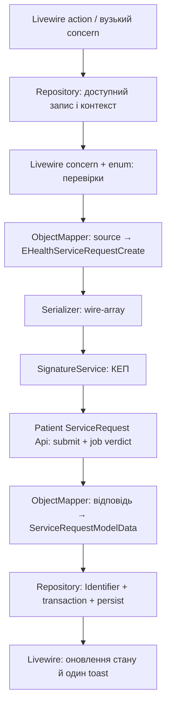

# Рефактор eHealth без прикладного сервісного шару

Оновлено 06.10.2026 після міграції Device та DeviceDispense, видалення referral/eRx/device lifecycle services і request-маперів: операції розподіляємо між Livewire, API-класами, enum і вузькими трейтами; mapping організовуємо за призначенням ModelData/EHealthData/FormData з підтримкою кількох типів джерел. Валідований Form або підготовлений Model дозволені як прямі джерела. Окремий шар Actions та нові класи Rules/Managers/Coordinators не вводимо.

Issue: [#841](https://github.com/openhealths/nationHealth/issues/841). Робоча гілка: `Mefizz/ohealth:i841_object_mapper_service_request`, база upstream main `1cf8b92e` після інтеграції 05.10, включно зі змердженим #907 та #792. Рефактор не публікується в гілку #792. Під час rebase збережено нові сценарії main, включно з eHealth referral search і поточним session-flash/x-message. Стан реалізації та результати тестів: [object-mapper-refactor.md](object-mapper-refactor.md).

## Стан реалізації 06.10

- Видалено `CarePlanLifecycleService`, `CarePlanActivityLifecycleService`, `EHealthJobResolver`; callers використовують API, а remote job statuses — окремий enum.
- Видалено `CarePlanLifecycleGateService`, `CarePlanActivityEHealthGuard`, `InformWith`. Запити відкритих документів — у Repository, властивості статусів — в enum, UI-перевірки — у protected Livewire concerns, auth-method extraction — чистий transform.
- Видалено `MedicalRequestOwnership`. Scoped lookup — у Repository, контекст закладу передає Livewire явно; approvals обмежені поточним care plan. Збережено Identifier UUID для перевірки Encounter.
- Patient ServiceRequest/DeviceRequest API виконують signed create/cancel та prequalify з перевіркою job/verdict; ServiceRequest також виконує recall. Транспортні wrappers видалено з referral lifecycle.
- `app/Dto/ServiceRequest/Model` та `app/Dto/DeviceRequest/Model` приймають локальні поля форми, підготовлену Eloquent-модель і відповідь eHealth. Спільні поля описані в `app/Dto/Referral/Model`; окремий source `ServiceRequestUse` задає мінімальні defaults взяття в роботу, не змінюючи partial GET sync. Relation loading і lookup відбуваються перед mapping.
- Outbound ServiceRequest, DeviceRequest та eRx create/prequalify/fallback sign перенесені на DTO. Незалежні golden fixtures перевіряють точний JSON на підпис, включно з числовими рядками, zero/false та вкладеним dosage.
- `ReferralRequestLifecycleService` видалено: take/qualify/complete/cancel usage працюють через спільний protected trait для HTTP і Livewire; draft створюють існуючі concerns; повторювані sign/sync/print кроки — вузькі concerns. API відповідає за verdict/job/SMS, Repository — за persisted поля й акторів. Успішний signed create зберігається до best-effort GET.
- Видалено `MedicationRequestLifecycleService` і статичний `Api/MedicationRequest` wrapper. Draft/sign/reject, raw-first підпис, active UUID, SMS і друк розподілено між вузькими protected concerns та наявним Patient API. Care-plan/encounter/standalone callers перенесено; eligible Encounter query — у Repository. Локальний статус змінюється після успішного API/job, INVALID verdict блокує створення.
- eRx `ModelData` приймає підготовлені локальні поля (`FormCollection`), preloaded модель та `stdClass` metadata; `DosageModelData` обробляє вкладені локальні dosage через MapCollection. `toSyncPatch()` обмежений попередніми сімома metadata-полями; raw documents і клінічні зв'язки не стають patch-полями. Block/unblock використовують UUID активного рецепта.
- Standalone device-форма передається прямо в ObjectMapper для окремих `EhealthDraft`/`EhealthDraftPrequalify`. Її API зберігає `/api/device_requests`, SNOMED coding і `signed_device_request_request`; Patient API не підміняє цей контракт. API перевіряє verdict/job, прийнятий raw-документ зберігається окремо від metadata.
- Видалено `DeviceRequestLifecycleService`, `EHealthRequestLifecycleService` і невикористовуваний `EHealthRequestLifecycleContract`. `DeviceRequestMapper` та `MedicationRequestMapper` не мали production callers після попередніх міграцій: класи і dead facade methods видалено; тести чинних payload-контрактів перенесено на DTO. Незалежні golden fixtures збережено.
- Два callers повного імпорту направлень у Repository використовують `ServiceRequestSearch` → той самий `ServiceRequestModelData`; `SourceClass` зберігає відмінні правила імпорту, use та partial GET. Alias precedence, початкові дати, incomplete Identifier rows і quantity=0 зафіксовані незалежним baseline. Repository зберігає автора/пацієнта, clinical links і правила пропуску наявних/повторних записів. `ServiceRequestMapper` та його невикористовуваний facade метод видалені.
- Care-plan create/update прямо мапить валідовану CarePlanForm у `CarePlan/Model` для draft та `CarePlan/Ehealth` для підписання. Server context передається в target; Repository payload formatter видалено. Вісім старих baseline cases перевіряють payload і точні signing bytes.
- Завершено CarePlan remote→Model, Model→Form та legacy model-source signPlan. Activity draft/sync/create/edit використовують DTO; Repository більше не готує payload. Protected Livewire concern завантажує relations і dictionary context перед mapping. Raw cancel змінює лише status_reason; complete має окремий unsigned PATCH DTO.
- Видалено ActivityRemainingQuantityGuard, CarePlanActivityValidationService, DeviceProgramParticipationGuard, CarePlanApprovalService та MedicationDispenseLifecycleService. Quantity SQL/lock — Repository, статуси — enum, умови й polling/UI — вузькі protected concerns, HTTP/pagination/verdict — наявні API. Approval enum/results перенесено в Enums/Dto. Загалом видалено 16 прикладних service/guard/helper класів.
- Посилено scope edit/save/delete/sign activity та approval polling: контекст іншого care plan не змінює його документи. Contract sync використовує переданий заклад, навіть якщо session містить інший.
- Залишається окрема encounter/FHIR хвиля: у Services/MedicalEvents **13 PHP-файлів**, із них 9 маперів, два package класи та два FHIR helpers. Складні DeviceRequest/MedicationRequest context adapters ще потребують спрощення під час міграції encounter форм; DTO вже володіють серіалізацією. Реальний КЕП/eHealth UAT і перевірка конкурентного issuance не завершені.

- PaperReferralMapper видалено: Procedure/DiagnosticReport callers використовують PaperReferral/Ehealth та Form. Дев'ять незалежних старих контрактів зберігають missing/null, paper/electronic priority і точний JSON. Тимчасова адаптація до camelCase обмежена старими parent-маперами, поки мігрує весь clinical resource.

- DetectedIssueMapper і DeviceAssociationMapper видалено разом із відповідними Fhir facade methods. EncounterPackageBuilder/Loader тепер використовують app/Dto/DetectedIssue та app/Dto/DeviceAssociation (Ehealth/Form). 29 незалежних baseline cases зі старого HEAD 1084b17e перевіряють точний JSON, missing/null, author={}, scalar zero/false, sparse lists і фактичних callers. UUID та час нових записів готує caller; різницю в одну хвилину для opening/closing pair і вже записані timestamps збережено. Спільні FhirReference/FhirCodeableConcept підтримують явно запитаний text, без зміни своїх defaults. Тимчасова адаптація snake_case DTO до старого camelCase package boundary залишається в builder і зникне разом із його міграцією. SQL persistence цих ресурсів залишається у чинних Repository.

## 1. Кінцевий результат

У перенесених медичних сценаріях немає залежностей від `App\Services\MedicalEvents`. Відповідні Service/Lifecycle/Guard/Mapper-класи видаляються після міграції всіх callers. Перенесення класу з тим самим набором обов'язків у `Actions`, `Classes` або великий трейт не вважається завершенням.

Зберігаємо наявні Repository та Eloquent для БД, Symfony ObjectMapper і DTO для контрактів. Вони виконують конкретну технічну роботу й не утворюють новий шар керування сценаріями. Не додаємо laravel-data, CQRS, generic repositories, універсальний FHIR SDK або інтерфейси заради одного класу.

SignatureService і dictionary infrastructure — раніше визначені винятки: їхню поведінку зберігаємо. Вони не виправдовують збереження medical lifecycle services. Повне фізичне очищення `app/Services`, включно з цими винятками та сторонніми модулями, відокремлено від медичного рефактору в розділі 8; не заявляємо, що #841 очищає всю папку.

## 2. Межі відповідальності

### Livewire: сценарій користувача

Компонент володіє формою, валідацією, перевіркою доступу до операції, відкриттям КЕП-модалки, loading state і повідомленнями. З нього має бути видно порядок: завантажити доступний запис → перевірити умови → побудувати DTO → підписати → викликати API → перевірити результат → записати → оновити UI.

Короткий сценарій залишається в компоненті. Повторювані частини для care plan, encounter і patient registry стають protected-методами спільного трейта. Сценарій не передається одному методу на кшталт `runLifecycle()` з десятками прихованих побічних ефектів.

Нові трейти розташовуємо у `app/Livewire/Concerns/MedicalEvents/{Referral,MedicationRequest,CarePlan,Activity}`; поведінка конкретного екрана лишається у його наявному `Concerns`. Поточні `ManagesCarePlanReferrals`, `ManagesEncounterReferrals`, `CarePlanManager` спочатку розділяємо за операціями, а не наповнюємо новою логікою.

### Api: взаємодія з ЕСОЗ

`app/Classes/eHealth/Api` володіє endpoints, HTTP, transport envelopes, response validation, pagination та перевіркою remote job/verdict. Існуючі низькорівневі методи й типи відповіді глобально не змінюємо.

Для операцій, що потребують завершеного результату, додаємо явні методи на відповідному API-класі, наприклад `createSignedAndResolve()` чи `prequalifyAndValidate()`. Назва показує очікування job; метод GET не починає приховано polling. Polling реалізований у `Api/Job`; спільні операції patient request API — у `Api/Concerns/ResolvesSignedPatientRequests`, специфічний endpoint — у своєму Api. Public methods — контракт API, допоміжні методи protected, без UI-стану й Eloquent.

Api не читає `auth()`, не отримує `$this->form`, не викликає SignatureService, не записує клінічні записи в БД, не надсилає Livewire events і не обирає текст toast. Він отримує payload/UUID явно, повертає валідовані дані або кидає типізований виняток. Наявний async approval polling через jobs/EhealthLink зберігається: його не замінюємо синхронним очікуванням.

### Enum: значення та властивості цих значень

`app/Enums` містить status, kind, source, resource type, terms of service та outcomes. Методи enum можуть відповідати на `isFinal()`, `isDraft()`, `canBeCancelled()` лише якщо відповідь визначається самим значенням. Якщо потрібні доступи, кількість, контракти чи стан інших документів — перевірка залишається у Livewire concern з явно підготовленими даними.

Enum не виконує SQL, HTTP, `app()`, `auth()` або перевірок прихованого стану. Статус job і статус медичного ресурсу — різні контракти; не створюємо один універсальний enum. Розширюємо наявні enum перед введенням нових. `CarePlanTermsOfService`, `Medication/RequestSource`, `Medication/RequestResourceType` уже існують у #792.

### Repository: дані та атомарність

Наявні `app/Repositories` залишаються місцем для scoped queries, aggregate queries, upsert, Identifier/FK, транзакцій і блокувань. Перевірка належності запису пацієнту/закладу виконується до мапінгу та підпису, а не після HTTP.

Repository отримує `*ModelData` або погоджений масив даних, а не Livewire-компонент чи eHealth client. Він не формує КЕП-документ, не виконує HTTP та не генерує HTML. Не переносимо сирий SQL у компонент заради видалення сервісу.

Перевірка кількості й блокування залишаються в тій самій атомарній області, що й відповідний локальний запис. Довгий HTTP/polling не додаємо всередину SQL-транзакції. Поточну поведінку lock спочатку фіксуємо тестами; окремо перевіряємо паралельні та повторні підписи. DTO із попередньо обчисленою кількістю не є резервуванням.

### ObjectMapper: чисте перетворення контрактів

Цільові DTO вже знаходяться в `app/Dto/<Resource>` за патерном змердженого #907: Model, Ehealth та окремі EhealthCreate/EhealthPrequalify для різних wire-контрактів. Старий `app/Mapping/EHealth` і ServiceRequestPayloads видалено разом із міграцією callers. SourceClass описує конкретні FormCollection/Model/response sources; search/use collections знаходяться в `Api/Responses/Collections`. Прямі validated screen sources уже використовуються standalone device/eRx. `app/Mapping/Transforms` залишається місцем спільних чистих перетворень; невеликі resource-specific static transforms можуть лишатися біля DTO. Нормалізація до wire-array залишається поруч із контрактом; вона не виконує workflow.

Атрибути ставимо на DTO, не на Eloquent і не на Livewire. Валідований Livewire Form або Model із явно завантаженими необхідними relations можна передавати mapper без додаткової копії джерела. DTO описує allowlist полів і точні property paths; для різних джерел застосовуємо SourceClass. Class-level Map(source: Form::class) сам по собі не перенаправляє читання в form.data[...] і не замінює валідацію чи ownership checks. Не серіалізуємо весь Form/Model; UI-стан, пароль та КЕП-файл не стають полями payload. SQL/HTTP під час mapping заборонені. Окремий snapshot лишається лише там, де потрібні вже перевірені UUID, час операції або однаковий незмінний документ для кількох callers.

### Патерн змердженого PR #907 — 05.10.2026

- Resource DTO у app/Dto, class-level Map із явними source classes, property-level SourceClass та вузькі static transforms біля DTO. Нового workflow-шару немає.
- У сценарії — map(source, Target::class)->toArray(). ObjectMapperInterface використовує наявний Laravel provider, потрібний для callable locators; final ObjectMapper не успадковуємо.
- FormCollection із main використовується для вже підготовлених local fields і nested dosage. Прямий Form/Model дозволений після валідації/preloading. Snapshot потрібний лише для перевірених UUID/часу і сталого підписуваного документа.
- Типізовані ServiceRequestSearch і ServiceRequestUse collections замінили source-wrapper DTO; один Model target зберігає різні import/sync правила. EHealthResponse::validate(): array|Collection інтегровано разом із main.
- Спільний EhealthMapping із #907 використовується через один protected hook: Division має незмінні правила, medical DTO зберігають 0/false/[] і literal dictionary keys. Порядок JSON до КЕП належить відповідному DTO та перевіряється старими fixtures.
- Composer узгоджено з main: mapper/serializer 8.1.8, прямий PropertyAccess dependency збережено. Решту dependency версій не оновлювали.
- У чистому main 1cf8b92e незалежно відтворено Division suite 91/401: 5 errors, 1 failure, 4 risky tests. Це окремий baseline обробки mapping errors/local draft-id; Division workflow не переписуємо в медичному PR. Не заявляємо green application suite.

### Уточнення за прикладом тімліда: ModelData / EHealthData / FormData

Це цільовий підхід за замовчуванням. Поточний код має багатоджерельні Model DTO та Ehealth targets, прямі preloaded Model sources і validated standalone screen sources. Локальний inbound використовує FormCollection; outbound направлення зберігає Input snapshot із явним UUID/time контекстом. Загальний Model→Form напрямок ще потребує окремої міграції. Не описувати всі напрямки mapping як завершені.

Для ресурсу визначаємо класи за призначенням, а не окремий DTO на кожну стрілку:

- `DivisionModelData`: поля для локальної моделі; приймає валідовану форму або валідований eHealth source. Різницю назв/форматів описують атрибути та `SourceClass` conditions в одному класі.
- `DivisionEHealthData`: дані для eHealth; джерелом може бути існуюча модель або валідована форма. Однаковий wire-контракт не потребує окремих DTO для кожного джерела.
- `DivisionFormData`: редаговані поля форми; джерело — модель або eHealth. Не містить UI flags, credentials, permissions чи стан модалок.

Класи створюємо лише за фактичної потреби: не обов'язково рівно три для кожного ресурсу. Використовуємо наявні типи Form/Model та object-source для API; не додаємо копію кожного джерела лише для `instanceof`. Для stdClass різницю ресурсів задає явний target; різні stdClass самі по собі не розрізняються через SourceClass. Якщо відрізняється структура, потрібні явні правила або інший тип джерела, а не припущення про походження об'єкта.

Symfony `SourceClass`/`TargetClass` дозволяють застосувати mapping для одного з кількох класів. Це не об'єднання кількох source objects за один `map()` і не автоматичне сканування будь-яких класів з суфіксом Data. Щоб правила DivisionModelData застосувалися, він повинен бути source/target у виклику або бути явно підключений через metadata configuration. Сам виклик `map($source, Division::class)` не знаходить сторонній DivisionModelData за назвою. [Офіційна документація](https://symfony.com/doc/current/object_mapper.html#matching-multiple-classes).

Приклад тімліда розглядаємо як концепцію розподілу mapping. Масив форми або відповіді адаптуємо в object одним викликом; не створюємо для цього додатковий шар DTO чи recursive JSON round-trip. ModelData містить правила записуваних полів і приймає кілька source classes.

Для локального запису перевіряємо source → ModelData → явний `new Division($data->toArray())` або `fill()` завантаженої моделі, після цього save чи наявний Repository. Правила mapping зберігаються на Data-класі. Generic direct mapping у Eloquent target із magic attributes потребує окремої перевірки metadata/casts і не є автоматичною заміною цього запису. Перевірити HasCamelCasing, mutators, події, дозволені поля та незмінність identity/ownership. Нормалізується тільки погоджений набір полів; не вводимо mapper, який повертає то array, то object. Перед mapping форма вже валідована.

Repository не є обов'язковою обгорткою простого save однієї моделі. Проте він залишається потрібним для транзакцій, scoped lookup, кількох таблиць і FHIR Identifier relationships, навіть коли всередині використовується Eloquent. Ці операції не є рутинним копіюванням DTO-полів.

Для ServiceRequest уже реалізовано `ServiceRequestModelData` для локальної форми та API-відповіді; окремий ServiceRequestWrite не створюємо. Input/Body/Payloads далі переглядаємо для Model → eHealth і повторного використання `ServiceRequestEHealthData`. `ServiceRequestFormData` додаємо лише під час фактичної міграції заповнення форми.

Виняток із одного EHealthData — справді різні контракти: prequalify envelope і документ для КЕП, create і raw cancel/reject, medication draft і prescription. Спочатку повторно використовуємо спільні дані, потім окремий transport envelope в API або вузький contract DTO, якщо цього потребують відмінні поля/правила. Кількість класів не скорочуємо шляхом прихованого режиму, який змінює підписуваний JSON.

Перед масштабуванням потрібні перевірки усіх реально підтримуваних напрямків: Form → Model, API → Model, Model → Form, Model → API та за потреби Form → API/API → Form; missing/null/[] при sync; точні JSON bytes перед підписом. Multi-source ModelData уже має незалежні fixtures для восьми ServiceRequest і десяти DeviceRequest API-відповідей та перевірки локальної форми. Актуальні результати регресії — у документі стану, історичні 124 тести стосуються попереднього outbound spike.

## 3. Правила для трейтів

- Один трейт відповідає за одну операцію або зв'язану групу перевірок: наприклад `SignsServiceRequests`, `SyncsServiceRequests`, `ValidatesActivityIssuance`, `ValidatesCarePlanCompletion`. Це приклади цільових ролей, не вимога створити всі файли наперед.
- Спільні методи приймають явні typed arguments: source, request, patient/legal-entity context. Трейт не припускає наявності `$this->carePlan`, `$this->activity` або полів іншого трейта. Потрібну host-залежність оголошує abstract-методом із return type.
- Типово методи protected/private. Public — лише навмисні Livewire actions, з повторною серверною перевіркою доступу; не робити helper public для зручності виклику між трейтами.
- Без constructor, singleton state, глобального cache поточного пацієнта та прихованого boot/hydrate. Публічний стан і Locked-поля оголошує компонент.
- Залежності надходять через Laravel DI у action/boot або явні параметри; не копіюємо `app()` в кожну гілку алгоритму. API traits не залежать від Livewire traits і навпаки.
- Повторне використання допускається між власниками з однаковою семантикою. Якщо два компоненти виконують різні операції, невелике повторення викликів краще за трейт з перемикачами десятка режимів.
- UI-логіка тестується через реальний компонент; Api concern — через API-класи з mocked HTTP. Тести не повинні перевіряти лише факт наявності `use SomeTrait`.
- Коли поведінка потрібна queue job або command, transport/persistence беруться з тих самих Api/Repository. Не створюємо Livewire-компонент у worker. Чистий reusable trait за такої потреби розміщується у `app/Concerns/MedicalEvents` з явними аргументами, без Livewire API.

## 4. Приклад вертикального ServiceRequest flow

```mermaid
flowchart TD
    UI[Livewire action / вузький concern] --> Access[Repository: доступний запис і контекст]
    Access --> Rules[Livewire concern + enum: перевірки]
    Rules --> Map[ObjectMapper: source → EHealthServiceRequestCreate]
    Map --> Wire[Serializer: wire-array]
    Wire --> Sign[SignatureService: КЕП]
    Sign --> API[Patient ServiceRequest Api: submit + job verdict]
    API --> Write[ObjectMapper: відповідь → ServiceRequestModelData]
    Write --> Save[Repository: Identifier + transaction + persist]
    Save --> Result[Livewire: оновлення стану й один toast]
```

Care plan, encounter і patient registry готують власний контекст доступу та використовують один mapping контракт. Спільний concern може реалізувати повторюваний крок підпису чи синхронізації, але не приховує різницю джерел і не містить універсальну фабрику всіх медичних ресурсів.

Для prequalify: source → `EHealthServiceRequestPrequalify` → Api перевіряє verdict → Repository створює локальну чернетку. Pending або INVALID не трактуються як дозвіл зберегти успішний результат. При збої API локальний clinical status не стає active.

## 5. Куди переходить кожна медична відповідальність

- `ReferralRequestLifecycleService`: create/sign/sync/cancel/recall послідовності — Livewire concerns; endpoints/SMS/job verdict — ServiceRequest/DeviceRequest Api; запити, контекст, persisted fields — repositories; mapping — DTO; print HTML/barcode — Blade та print concern. Після міграції всіх callers клас видаляється.
- `MedicationRequestLifecycleService`: concerns create/sign/reject/sync; API отримує готові payload; Repository розв'язує контекст і зберігає raw snapshot. Пріоритет підпису raw draft → fetched raw → локальний fallback зберігається.
- `CarePlanLifecycleService`, `CarePlanActivityLifecycleService`, `DeviceRequestLifecycleService`: короткі wrappers розчиняються в явних методах Api; UI sequence — у наявних компонентах/вузьких concerns. Не дублюємо кожен API-метод ще одним UI-трейтом без поведінки.
- `EHealthRequestLifecycleService`: базове наслідування видаляється. Transport error handling/prequalify resolution — Api concerns; signer tax ID перевіряється на межі підписання в Livewire, до відправлення документа.
- `EHealthJobResolver`: polling, fallback URL, timeout та успішність — `Api/Job`; статуси — окремий enum контракту job, якщо наявний enum не відповідає цьому набору. Зберегти 404 fallback, інтервали, ліміти й типи винятків; не змінювати їх разом із переносом.
- `CarePlanLifecycleGateService`: запити відкритих документів — Repository; властивості статусів — enum; поєднання умов cancel/complete — `ValidatesCarePlanCompletion`/відповідний concern; текст помилки — translations/UI.
- `CarePlanActivityValidationService`: providing conditions, rehab reason references — `ValidatesCarePlanActivity`; чисте розбирання API/category форми — Mapping; кінцеві коди — enum тільки для справді замкненого набору, не для динамічного довідника ЕСОЗ.
- `ActivityRemainingQuantityGuard`: issued totals і lock — Repository; allowed status sets — enum; UI-повідомлення й виклик атомарної перевірки — concern. Не замінювати захист БД одним порівнянням у Livewire.
- `CarePlanActivityEHealthGuard`: наявність activity — Api; рішення продовжити/показати помилку — concern. Не ковтати transport failure як відсутність запису.
- `DeviceProgramParticipationGuard`: remote contracts/catalog — Api із повною pagination; локальний sync — Repository; Livewire concern явно з'єднує fetch → validate → persist → assessment. Blocking/warnings — існуючий DTO, рішення над готовими фактами — вузький concern. Без прихованого sync під назвою `isAllowed()`.
- `MedicalRequestOwnership`: scoped queries та employee/legal-entity перевірки — відповідні repositories; Livewire перевіряє дозвіл на дію. Зберегти person/encounter/care-plan/legal-entity scopes для всіх публічних actions, зокрема повторно після зміни UI state.
- `ResolvesEmployeeContext`: lookup — Repository, вибір UI context — concern; у mapper передаються вже отримані UUID. Зберегти author/acting employee fallback.
- `CarePlanApprovalService`: create/confirm/deactivate/resend — Approval Api; запуск і стан async operation — наявні jobs та UI polling concern; зв'язки/статуси — Repository; OTP/input/toasts — компонент. Два outcome enum → `app/Enums`; два result DTO → `app/Dto/MedicalEvents`. Не робити OTP або підтвердження доступу transform-ом.
- `MedicationDispenseLifecycleService`: qualify/create/process — Api; порядок кроків — dispense component/concerns; дані — DTO/Repository. Окремий інкремент після referral/eRx.
- `InformWith`: auth-method extraction — чисте mapping-перетворення; select/display value — UI concern. Об'єкт у ServiceRequest і рядок у medication create не уніфікувати штучно.
- `EncounterPackageBuilder`, `EncounterPackageLoader`: читання графа — Repository; генерація UUID/контексту — encounter concern; DTO — app/Dto, спільні чисті transforms — app/Mapping. Зберегти порядок diagnoses/conditions та відмову без condition.
- Початкові 17 legacy `MedicalEvents/Mappers`: ServiceRequest, DeviceRequest, MedicationRequest, PaperReferral, DetectedIssue, DeviceAssociation, Device і DeviceDispense вже видалені. Залишається 9: ClinicalImpression, Condition, DiagnosticReport, Encounter, Episode, Immunization, Observation, Procedure, Specimen. `Fhir`, `FhirResource`, `FhirMapperContract` видаляються після останнього caller. Не залишати facade лише для підтримки мертвих wrappers.

`DeviceActivityReadinessAssessment` уже перенесено до `app/Dto/MedicalEvents` у #792; повторного перенесення немає. Рахунок на базовому head: 42 PHP-файли в `Services/MedicalEvents`, із них 17 маперів. Критерій завершення всіх медичних хвиль — відсутність цієї прикладної папки та imports на неї, включно з tests/jobs/commands/providers.

## 6. Контракти, які не можна втратити

- ObjectMapper 8.1.8 узгоджено зі змердженим #907; Laravel provider використовує PSR-11 transform/condition locators. Class-name callables реєструємо явно, бо Laravel `has()` не гарантує autowiring. Мінімум пакета PHP 8.4.1, перевірений runtime PHP 8.5.3. Не оновлюємо весь Composer стек.
- `MapCollection(targetClass: ...)` використовується для списків об'єктів, не для scalar lists чи готових array rows. Джерела готуються явно, індекси JSON-списків послідовні. `(object) $array` не перетворює вкладені об'єкти автоматично.
- ObjectMapper не серіалізує JSON. Зберегти missing/null/[], 0/0.0/false, порядок ключів, UTC/timezone/DST та JSON flags SignatureService: `JSON_THROW_ON_ERROR | JSON_PRESERVE_ZERO_FRACTION`. Перевіряти байти до Cipher, а не nondeterministic PKCS#7.
- `based_on_id`/`context_id` — FK Identifier, а не ID activity/encounter. UUID → Identifier/local FK лише в Repository, без SQL у transforms. Час/UUID операції генерує caller, не mapper.
- Prequalify envelope і flat signed-create — різні DTO. Не створюємо один DTO з взаємовиключними service/device/medication полями. `programs` і `program` мають різні контракти.
- `ServiceRequestModelData`/`MedicationRequestModelData` враховують presence полів при частковому import. Nullable значення DTO саме по собі не є командою очистити поле; explicit null/[] застосовуються лише за правилами конкретного контракту. Author/links/dosage не стираються через неповний search result.
- Raw отриманий документ зберігається й підписується з невідомими полями. Не пропускаємо його через урізаний create DTO. Fallback реконструкції eRx мігруємо окремо.
- Розрізняємо MedicationRequestRequest і MedicationRequest, UUID draft/prescription, source/resource_type. Наявні enum використовуються повторно. Dosage та dose_and_rate мають власні wire-контракти.
- CarePlan API має `setValidator()`/`replaceEHealthPropNames()`, а не запропонований раніше `setMapper()`. Реальні точки перенесення — API renaming та Repository formatting; загальний EHealthResponse array-контракт не змінюємо.
- #792 валідовує всі сторінки контрактів до транзакції й позначки COMPLETED. Частковий набір не стає авторитетним списком програм.
- Approval confirm/deactivate відхиляють неуспішний response; patient-scoped API явний. eRx sync обробляє кілька рецептів, loading скидається при помилці.
- AJAX — один localized toast, redirect — session flash. Не повертати передчасний success до approval confirmation. Обидва activity handlers, викликані Blade, залишаються доступними.
- Legacy device request-request endpoint і `signed_device_request_request` не замінюються patient createSigned endpoint лише через схожість назв.

## 7. Порядок реалізації

### #841a — наявний outbound spike

Уже зроблено: provider/package, source, prequalify/create DTO, normalization, перенесення outbound callers encounter/care-plan/patient-registry. Вісім golden fixtures записано зі старого mapper `4b1f0e7`; mapper не змінився до `d91299f`. Baseline не перегенеровуємо з нової реалізації. Історичний прогін реалізації: 124 tests / 608 assertions, без errors/failures, одне PDO deprecation. Зміна цього документа не є новим прогоном тестів.

### #841b — завершити ServiceRequest вертикально без lifecycle service у цьому flow

1. Зафіксувати inbound fixtures: detail, partial search, explicit null/[], aliases, Identifier links, local author/quantity preservation.
2. Додати багатоджерельний ServiceRequestModelData і перевести Repository на явну семантику оновлення полів.
3. Розмістити submit/job/prequalify methods у ServiceRequest Api, зберегти існуючі low-level endpoints для інших callers.
4. Винести повторювані sign/sync кроки в protected Livewire concerns; компонент готує контекст і показує результат. Перевести care plan, encounter, registry разом із tests.
5. Прибрати service-гілки з ReferralRequestLifecycleService й legacy mapping delegates, які втратили callers. Device-гілки залишаються лише до наступного інкременту.

Критерій: перенесений service-request flow не звертається до lifecycle service; bytes/API/job/persist/UI відповідають baseline. Issue не закриваємо лише за наявності DTO.

Оновлення 05.10: take/qualify/complete/cancel usage перенесено з lifecycle service у вузький `app/Traits/MedicalEvents/UpdatesReferralExecution`, спільний для Livewire і HTTP-контролера. Він не залежить від Livewire properties: аргументи явні, DTO формує payload, Api завершує job/verdict, Repository зберігає статус лише після успіху. Resource type — enum. Draft creation знаходиться у відповідних care-plan/encounter concerns; signing, sync та print розділені на `PreparesReferralSigning`, `SynchronizesReferrals`, `PrintsReferrals`. Всі callers перенесені; `ReferralRequestLifecycleService` видалено. Наявний quantity guard збережено без зміни області транзакції; його Repository/enum міграція залишається окремим кроком. Три request-мапери вже видалені; FHIR helpers ще потрібні решті 14 encounter-маперів.

### Наступні інкременти

- DeviceRequest outbound і спільний referral workflow завершено 05.10: `app/Dto/DeviceRequest` із окремими create/prequalify контрактами, MapCollection, явним часом/UUID, без SQL/HTTP. Вісім незалежних fixtures з `9eb61910` фіксують signed JSON і edge cases. Draft/sign/sync/print/SMS callers вже не залежать від ReferralRequestLifecycleService; клас видалено. Standalone device-форма теж використовує DTO та свій API. DeviceRequestMapper не має production callers і видалений; його невикористовувані toFhir/fromFhir не переносимо заради збереження мертвого API.
- eRx основні структуровані create/prequalify/dosage/fallback-sign та partial metadata sync використовують `app/Dto/MedicationRequest`. Сім незалежних fixtures з `2ea796ca` фіксують bytes. `MedicationRequestLifecycleService` і статичний API wrapper видалено 05.10: callers використовують protected draft/sign/reject/signing/identity/print concerns, наявний Patient API та Repository. Raw-first і eligibility збережено; standalone component із рядковим dosage вже напряму мапиться у власні draft/prequalify DTO. MedicationRequestMapper не мав production callers і видалений. ServiceRequest legacy inbound і namespace міграція завершені; care-plan/activity mapping і guards також перенесені.
- Care plan: Form→Model для save draft і Form→Ehealth для create/update signing уже перенесені. Server-resolved UUID/author/encounter/timezone передаються в існуючий target; source залишається CarePlanForm. Repository::formatCarePlanRequest видалено, вісім незалежних baseline cases з `17955764` зберігають старі arrays та signing bytes. Lifecycle/Gate services уже видалені. Remote→Model, реальна Model→Form hydration і legacy model-source signPlan перенесені. Raw cancel/status documents не реконструюємо через create DTO.
- Activities: draft/sync/create/edit і unsigned complete мають DTO; cancel зберігає повний raw snapshot. Livewire готує context та workflow, API виконує HTTP/job, Repository зберігає дані й quantity lock. ActivityLifecycle/Validation/EHealthGuard, remaining-quantity і device-participation guards видалені.
- Approvals/OTP і pharmacy dispense перенесені; відповідні сервіси видалені. Збережено async jobs, read access, inpatient без OTP, raw signing та порядок process/persist.
- Решта encounter-маперів, package builder/loader і Composition: окрема хвиля для повного усунення `Services/MedicalEvents`; після останнього caller прибрати base lifecycle, Fhir facade/helpers/contracts.

Видалення сервісу входить у критерій завершення відповідного інкременту. Не відкладаємо всю архітектуру «на потім», залишаючи довготривалі сумісні wrappers.

### Device — 06.10.2026

DeviceMapper і Fhir::device() видалено. Фактичні EncounterPackageBuilder/Loader використовують app/Dto/Device/Ehealth та Form; вкладені names, identifiers і properties проходять через MapCollection. Name спільний для обох напрямків, Identifier/Property мають окремі API/form контракти через різну структуру збережених relations. 16 незалежних baseline cases із b6d85983 фіксують старі JSON bytes, missing/null, 0/false, sparse lists, nullable quantity/range metadata і no-IO mapping. UUID генерує caller. Два PostgreSQL round-trip тести перевіряють фактичний builder → Repository → loader для Person/Preperson, FHIR links та всі шість типів property. Старий Quantity float cast збережено. Тимчасовий camelCase package adapter конвертує також вкладені DTO; persistence лишається в Repository.

На етапі Device лишалося 10 encounter-маперів; DeviceDispense перенесено наступним інкрементом. Зараз лишаються ClinicalImpression, Condition, DiagnosticReport, Encounter, Episode, Immunization, Observation, Procedure, Specimen. Наступний інкремент — Specimen; builder/loader і Fhir helpers прибираємо після міграції всіх callers.

### DeviceDispense — 06.10.2026

DeviceDispenseMapper і Fhir::deviceDispense() видалено. EncounterPackageBuilder/Loader використовують app/Dto/DeviceDispense/Ehealth та Form; details і supportingInfo проходять через MapCollection. UUID/encounter готує caller, supporting-document SQL lookup лишається в loader/Repository. Form отримує готовий detailsMap, який не потрапляє у форму; дублікати references й порядок збережено. 16 незалежних контрактів зі старого 3fefa411 перевіряють точний JSON, model/type, integer quantity casts, missing/null, sparse lists, перший details і DST. Два наявні legacy payload тести перенесено на DTO зі збереженням поведінкових assertions. Чотири PostgreSQL тести для Person/Preperson × model/type перевіряють фактичні builder → store/sync → loader, ownership, Identifier links, quantity=0, supporting condition metadata та display fields. DTO не виконує SQL/HTTP/session lookup.

## 8. Решта app/Services

Підпис і dictionary-код не розкладаємо по Livewire/enum: це спеціалізована інфраструктура, раніше виключена з функціонального рефактору. Якщо фінальна ціль включає фізичне видалення всієї папки, їх переносимо окремою механічною хвилею без зміни поведінки: підпис до наявного `app/Classes/Cipher`, dictionary infrastructure до предметного каталогу `app/Classes/Dictionary`. Оновлюються providers/helpers/imports; робочий Cipher API залишається у своєму каталозі. Це єдиний допустимий перенос цілої інфраструктурної реалізації, а не спосіб сховати LifecycleService.

Інші модулі потребують окремого інвентарю callers перед видаленням:

- EmployeeRequestProcessor/Matcher: API для remote sync, Repository для approved-only apply/roles/transaction, workflow у відповідному компоненті або наявному job, чисте зіставлення — невеликий concern із явними даними.
- PartyVerificationBulkAccess/Cache: scopes/queries у Repository, bulk operation у component/job concern; кеш залишається частиною механізму перевірки, не enum. Зберегти invalidation та scope.
- MedData/VaccineLot: transport у власній інтеграції MedData, mapping окремо, cache/persistence у відповідному власнику. Не додавати сторонню інтеграцію до eHealth Api.
- EmailService: наявні Laravel Mail/Notification та їх callers; не класти email у медичні API-класи.

Ці модулі не входять у #841 і не видаляються механічно слідом за medical flows. Повне очищення папки вважається виконаним лише після окремої міграції всіх цих callers.

## 9. Перевірки та завершення

Кожен інкремент має contract tests DTO/JSON, API tests endpoint/envelope/pagination/job, Repository tests partial updates/FHIR links/transaction, Livewire tests sign/sync/failure/loading/toast/ownership. Перевірки status/quantity/access не зникають при переміщенні в enum чи trait.

При роботі з трейтами перевіряємо всі компоненти-власники, а не один екран: відсутність прихованих property dependencies, колізій методів і ненавмисно public actions. При перенесенні polling перевіряємо timeout/failed/unknown status та відсутність успішного persist до verdict.

Після видалення класу шукаємо imports/container bindings і динамічні виклики в app/tests/jobs/commands/providers. Перенесені тести зберігають поведінкові assertions; не переписуємо їх на перевірку факту виклику нового класу.

Рефактор виконується в окремому worktree з isolated Sail/PostgreSQL. Mapping-only зміни не потребують міграцій схеми. Відкат — revert відповідного інкременту; fixtures не маскують зміну поведінки. Реальний КЕП/eHealth UAT потрібний перед rollout.

База upstream main `b2239108` уже містить #847/#820 (`PatientData.php`, personal data sync), #792 та нові сценарії diagnostic/specimen/referral search. Ці зміни збережено під час rebase 30.09; main 1cf8b92e з #907 інтегровано 05.10.

Готовність оцінюємо разом: прикладні сервіси видалені, сценарій читається в Livewire, Api не залежить від UI/БД, enum не має побічних ефектів, трейт не приховує весь домен, поле eHealth змінюється в одному mapping-контракті, а перевірки існуючої поведінки проходять.

Остання медична регресія після DeviceDispense: **634 тести / 3234 assertions**, без failures/errors/skipped/risky tests; одне попереднє PDO deprecation. Перевірено незалежні mapping/JSON/no-IO контракти, фактичні encounter builder/loader і PostgreSQL store/sync/load, API/job, Repository/Identifier links, care plan, referrals, eRx/device, registry, approvals і pharmacy dispense. Pint пройшов для 12 PHP-файлів інкременту; git diff --check проходить. Використано чинне isolated mapper841 PHP 8.5.3/PostgreSQL без нових контейнерів; робочі ohealth контейнери й дані не змінювалися. Composer і схема БД не змінювалися. Реальний КЕП/eHealth UAT та HTTP authorization suite із Vite assets ще потрібні.

Повний Division feature suite окремо має 91 тест / 401 assertions, п'ять errors, один failure та чотири risky tests. Ті самі збої підтверджено на незалежно завантаженому незміненому main `1cf8b92e`; це не результат medical mapping. Потрібно окремо виправити exception handling/persistence до заяви про application-wide green. Звіт про завершені та наступні кроки: [object-mapper-progress-report.md](object-mapper-progress-report.md).
