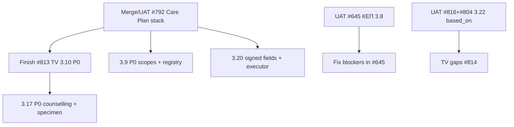

# Кореляція ТВ НСЗУ-464 ↔ стан MIS (модулі Mefizz)

**Дата зрізу:** 2026-09-16  
**Норматив:** PDF у цій теці (редакція наказу НСЗУ 464 від 25.08.2026)  
**База аудитів:** `audits/*` (2026-09-14) + оновлення по PR #645/#792/#804/#813/#816  

### Легенда статусу

| Мітка | Значення |
|-------|----------|
| ✅ | Відповідає / достатньо для приймання за цим підпунктом (за статичним аудитом + відомими UAT) |
| ⚠️ | Частково: є код, але є дірки (серверні гейти, UX, тести, UAT) |
| ❌ | Відсутнє / зламано / блокує приймання |
| 🔄 | У активній гілці/PR; ще не в `main` або не прийнято UAT |
| 👤 | Потрібна участь людини (КЕП / рішення продукту) |

**Оцінка %** — інженерна оцінка покриття модуля, **не** офіційний сертифікаційний вердикт НСЗУ.

---

## Зведена таблиця

| ТВ | Модуль | Оцінка | Головний артефакт | Головний блокер зараз |
|----|--------|-------:|-------------------|------------------------|
| **3.8** | Медичні висновки | ~55–70% у PR | [#645](https://github.com/openhealths/nationHealth/pull/645) | 👤 КЕП UAT; у аудиті — create/sign і async cancel |
| **3.9** | ЕР на ЛЗ | ~65% | PR [#792](https://github.com/openhealths/nationHealth/pull/792) stack | Scopes на діях; patient details/reject; price catalog |
| **3.10** | План лікування | ~72% + 🔄 P0 | [#813](https://github.com/openhealths/nationHealth/pull/813) + [#792](https://github.com/openhealths/nationHealth/pull/792) | Encounter/author/draft-first/activity gates (див. #809) |
| **3.17** | Е-направлення | ~60–70% | код у #792 / main | DOCTOR×counselling; specimen; reuse minutes; complete+program |
| **3.20** | Е-запити на МВ | ~50% + 🔄 | #792 (без програми) | inform_with/reason/params; executor revoke/complete; A5 print |
| **3.22** | Відпуск МВ | ~35–50% + 🔄 | #804 + #816; TV [#814](https://github.com/openhealths/nationHealth/pull/814) | Повний TV 3.22 ще WIP; based_on лише без програми |

Детальні таблиці — нижче. Докази з файлами — у `audits/`.

---

## 3.8 Модуль «Медичні висновки»

**PR:** [#645](https://github.com/openhealths/nationHealth/pull/645) · **Issue:** #644 · **Аудит:** [audits/3.8-compositions-pr645.md](./audits/3.8-compositions-pr645.md) · **UAT:** [prompts/38-uat-checklist.md](./prompts/38-uat-checklist.md)

| Область ТВ | Статус | Зроблено | Треба зробити |
|------------|--------|----------|---------------|
| МВН / МВТН API + mapper | ⚠️ | Клієнти, FHIR shape, TEMP_DISABILITY маркери, print iframe | Звірити `event.period.end` МВН з актуальною редакцією PDF |
| Ролі × тип закладу | ⚠️ | OUTPATIENT / PRIMARY_CARE обмеження в policy | Жорстко: МВН = OUTPATIENT+SPECIALIST; МВТН = PRIMARY+DOCTOR або OUTPATIENT+SPECIALIST |
| Створення + КЕП | ❌/🔄 | Модалка підпису в UI | У аудиті: `submitComposition` відсутній; create шле unsigned payload — **перевірити актуальний tip гілки** і полагодити якщо ще так |
| Async create / sign / get | ⚠️ | Polling create/sign, getComposition | E2E тести; стійкий poll після reload |
| Друк без реклами | ✅ | sandboxed iframe | Підтвердити template IDs у середовищі |
| Вагітність / категорії preperson | ⚠️ | UI + config API | Server-side fail-closed; тести |
| Скасування + ERLN retry | ❌/⚠️ | UI entry | Persist job id + poll; не drop таблиці compositions у міграції |
| UAT з реальним КЕП | 👤 | Чекліст готовий | Пройти [38-uat-checklist](./prompts/38-uat-checklist.md) |

**Наступний крок агента:** `prompts/04-tv-38-uat.md` (або фікс create/sign якщо UAT падає).

---

## 3.9 Модуль «Облік ЕР на ЛЗ в СГуСОЗ»

**Стек:** [#792](https://github.com/openhealths/nationHealth/pull/792) · **Аудит:** [audits/3.9-medication-request.md](./audits/3.9-medication-request.md) · **Промпт:** [prompts/39-medication-v3.md](./prompts/39-medication-v3.md)

| Область ТВ | Статус | Зроблено | Треба зробити |
|------------|--------|----------|---------------|
| Створення з activity ПЛ | ✅ | based_on CP+activity, context encounter, intent/order, community | — |
| Encounter path (сьогодні + self) | ⚠️ | UI після finished encounter | Server enforce today/self на standalone |
| Програма / каталог цін | ⚠️/❌ | Program-scoped drug search (standalone) | **Price/reimbursement catalog відсутній** |
| Dosage / packaging / daily max | ⚠️ | Сильніше на care-plan path | Дотягнути standalone до тих самих гейтів; max period block |
| `inform_with` + success copy | ✅ | Auth methods + SMS/print повідомлення | — |
| Підпис MRR | ⚠️ | signed_medication_request_request | Точні TV labels у UI |
| Patient registry search/details | ⚠️/❌ | Dual-tab / eHealth search на #792 | Details expand; reject/resend у registry; **scopes medication_request:*** на діях |
| Access matrix LE/role | ❌ | Scopes у config | Реальна матриця + тести |

**Наступний крок:** окремий issue від аудиту P0 (permissions + patient details) поверх #792 після merge або від tip #792.

---

## 3.10 Модуль «План лікування»

**Аудит:** [audits/3.10-care-plan.md](./audits/3.10-care-plan.md) (~72%) · **Compliance PR:** [#813](https://github.com/openhealths/nationHealth/pull/813) (#809) · **Функціональний стек:** [#792](https://github.com/openhealths/nationHealth/pull/792)

| Область ТВ | Статус | Зроблено | Треба зробити |
|------------|--------|----------|---------------|
| CRUD/sign ПЛ, activities 3 kinds | ✅/⚠️ | Широке покриття API/UI/тестів | Серверні інваріанти (нижче) |
| Encounter обовʼязковий + author з encounter | ❌→🔄 | UI список finished encounters | #809: validation + author = encounter author |
| Draft-first до eHealth | ⚠️→🔄 | Save draft існує | Інваріант на всіх sign path; прибрати дивергентний `signPlan` |
| Approval write перед activity | ⚠️→🔄 | UI lifecycle | Явний server gate granted write + LE match |
| Kind/product/program validation | ⚠️→🔄 | Частково | Enum kind; medication program type; device XOR codeable |
| Lifecycle cancel/complete + gates | ✅ | Prechecks MR/DR/SR, UK warnings, KEP | Sync перед transition (P1) |
| Device activity **без** медпрограми | 🔄✅ | #792: «Без програми», skip PreQualify | UAT + merge #792 |
| MED_COORDINATOR | ⚠️ | Scopes | Узгодити author selection (P1) |

**Наступний крок агента:** `prompts/03-tv-310-continue.md`.

---

## 3.17 Вимоги до електронних направлень

**Аудит:** [audits/3.17-service-request.md](./audits/3.17-service-request.md) · **Промпт:** [prompts/317-service-request-v3.md](./prompts/317-service-request-v3.md)

| Область ТВ | Статус | Зроблено | Треба зробити |
|------------|--------|----------|---------------|
| Create з ПЛ / без ПЛ, draft, sign | ✅ | Lifecycle + KEP PKCS#7 | Edit draft як повноцінний update |
| PreQualify | ⚠️ | Лише з program_id | Підтвердити по PDF чи qualify завжди обовʼязковий |
| Print / recall / cancel | ✅/⚠️ | CODE128 custom print; signed recall/cancel | Офіційний eHealth printout якщо ТВ вимагає |
| Executor use + used_by_employee | ✅ | qualify (з program) → use | — |
| DOCTOR × counselling ban | ❌ | — | Server gate до qualify/use |
| Specimen / impersonal | ❌ | Scope в config | Workflow + без PII в DOM |
| Reuse minutes | ❌ | — | Persist used_at + TTL |
| Complete + program + remaining qty warning | ❌/⚠️ | Complete з based_on EMR | Program у complete payload; TV warning |

**Наступний крок:** issue на P0 (counselling + specimen), гілка від актуального referral-стеку.

---

## 3.20 Вимоги до обліку е-запитів на медичні вироби

**Аудит:** [audits/3.20-device-request.md](./audits/3.20-device-request.md) · **Оновлення:** PR [#792](https://github.com/openhealths/nationHealth/pull/792) додав **Care Plan device без медпрограми** (критично для 3.22 based_on) · **Промпт:** [prompts/320-device-request-v3.md](./prompts/320-device-request-v3.md) + [prompts/02-device-dispense-care-plan.md](./prompts/02-device-dispense-care-plan.md)

| Область ТВ | Статус | Зроблено | Треба зробити |
|------------|--------|----------|---------------|
| Видача з activity ПЛ + program | ⚠️ | Catalog, packaging, remaining, PreQualify, sign | Active-state gate строго; success copy за ТВ |
| ДЗР / **без програми** | ❌→🔄✅ | #792 optional program + skip PreQualify | Merge #792; standalone encounter path все ще ❌ |
| Same-day self encounter standalone | ❌ | — | Окремий UI/flow |
| `inform_with` / reason / parameters у підписі | ❌ | Частково в UI | Persist + mapper у signed DeviceRequest |
| Search/details eHealth | ⚠️ | Local registry | Remote list/details |
| Resend SMS | ✅ | Patient API | Тест |
| Revoke / complete / dispenses list | ❌ | — | Executor lifecycle; звʼязок з 3.22 |
| A5 printout | ❌ | Generic HTML | A5 / eHealth print form |
| Success messages OTP×program | ❌ | Generic flash | Точні тексти з ТВ |

**Наступний крок:** після #792 — P0 issue «DeviceRequest signed fields + inform_with».

---

## 3.22 Вимоги до обліку відпуску медичного виробу

**Аудит (застарілий scaffold):** [audits/3.22-device-dispense.md](./audits/3.22-device-dispense.md)  
**Оновлення runtime:** colleague [#804](https://github.com/openhealths/nationHealth/pull/804) **merged**; follow-up `#816` based_on з eHealth; TV WIP [#814](https://github.com/openhealths/nationHealth/pull/814) (#806)

| Область ТВ | Статус | Зроблено | Треба зробити |
|------------|--------|----------|---------------|
| Секція в Encounter Package | 🔄⚠️ | Реальний dispense path після #804 (не лише mock аудиту) | Повна TV-відповідність quantity/pharmacy vs ЗОЗ |
| `based_on` DeviceRequest | 🔄⚠️ | Load active з eHealth; **фільтр: лише без program** | UAT + тести; empty-state аптека |
| Payload у signed package | 🔄 | Builder/include після #804 | Підтвердити всі поля 3.22.2 vs PDF |
| Partial/full quantity rules | ⚠️/? | Prefill remaining у #804 follow-ups | ЗОЗ vs pharmacy full-only (залежить від 3.5.2) |
| Patient registry dispenses | ❌/⚠️ | Раніше mock | Замінити demo на eHealth-backed list |
| Повний TV module PR | 🔄 | Scaffold #814 | Колега / або допилка після UAT #804+#816+#792 |

**Критичне правило eHealth (підтверджено UAT):**  
`Device request with program can not be referenced` у Encounter Package → для based_on потрібен Device Request **без** медпрограми (ланцюг через #792).

**Наступний крок агента:** `prompts/02-device-dispense-care-plan.md`; повний TV — окремо за #806.

---

## Рекомендований порядок робіт

1. 👤 **3.8** — КЕП UAT #645  
2. 👤/🔄 **3.22 smoke** — no-program DR (#792) → Encounter dispense (#804/#816)  
3. 🔄 **3.10** — закрити #813  
4. **3.9 / 3.20 / 3.17** — P0 з аудитів окремими issues (1 issue = 1 PR)

---

## Як оновлювати цей файл

Після кожного merge/UAT модуляного модуля:
1. Змінити мітки в таблицях вище.
2. Дописати 2–3 рядки в «Зроблено / Треба».
3. За потреби оновити детальний `audits/3.XX-*.md` (нова секція «Post-implementation matrix»).
4. Коміт у цю гілку або follow-up `#822 …`.
